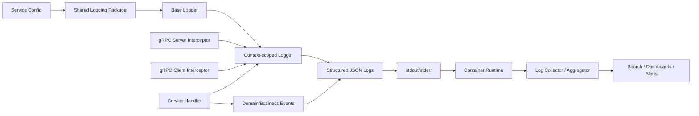
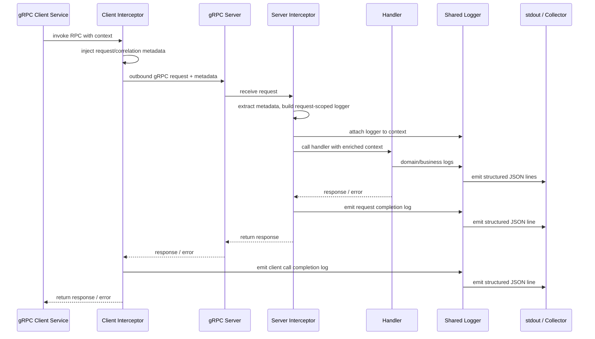

# A. High-level architecture

## Design goal

Build a **small shared logging package** that gives every service the same logging behavior by default, while leaving room to evolve later without forcing rewrites.

The simplest shape is:

* **Core logging package**

  * emits structured logs
  * manages logger creation and config
  * stores/retrieves logger and request metadata from `context.Context`
  * provides helper methods for standard events
* **gRPC interceptor package**

  * injects/request-scopes logger data
  * propagates correlation/request metadata
  * emits standardized request lifecycle logs
* **service code**

  * uses logger from context
  * emits domain/business logs
  * returns typed errors or wrapped errors
* **container/log pipeline**

  * services write JSON logs to stdout/stderr
  * collection/aggregation is external
  * shared package is not responsible for shipping logs

That separation keeps the package maintainable and avoids turning it into a platform monolith.

## Recommended principles

1. **One default logger format everywhere**

   * JSON, one event per line

2. **Context carries request-scoped logger metadata**

   * request ID
   * trace/correlation ID
   * service name
   * method name
   * peer/caller info where available

3. **Interceptors handle operational request logging**

   * request started/completed
   * duration
   * status code
   * retry/correlation metadata propagation

4. **Handlers own business logs**

   * “order approved”
   * “invoice generated”
   * “fraud check failed”
   * not emitted automatically by middleware

5. **Package owns defaults, services own only light config**

   * service name
   * environment
   * level
   * output mode
   * optional sampling/redaction hooks later

6. **Do not hard-couple to one backend**

   * define a thin internal abstraction
   * optionally implement with `slog` first
   * keep external API stable even if backend changes

## Recommended architectural stance

For v1, do **not** try to solve:

* distributed tracing end to end
* log sampling sophistication
* PII detection engine
* dynamic config reload
* pluggable exporters
* automatic payload logging
* HTTP + gRPC + async workers all at once

Start with **gRPC + context + JSON + stdout**.

## Architecture diagram



---

# B. Package/module structure

Keep it small. A good v1 structure:

```text
internal/platform/logx/           # or shared/logx if published internally
  logger.go
  config.go
  context.go
  fields.go
  event.go
  level.go
  error.go
  grpc/
    server.go
    client.go
```

If you want this as a reusable internal module across repos:

```text
github.com/your-org/platform/logx
  logger.go
  config.go
  context.go
  fields.go
  event.go
  error.go
  grpc/
    server.go
    client.go
```

## Why this structure works

It keeps the package divided by responsibility, not by too many layers.

* `logger.go`: logger creation, API surface
* `config.go`: config model and defaults
* `context.go`: inject/extract logger and request metadata
* `fields.go`: standardized field constants/helpers
* `event.go`: standardized event names/constants
* `error.go`: error classification helpers
* `grpc/server.go`: server interceptors
* `grpc/client.go`: client interceptors

## Avoid this in v1

Do not create all of these unless you already need them:

* `formatter/`
* `transport/`
* `exporter/`
* `middleware/chain/`
* `plugins/`
* `registry/`
* `observability/`

That is how logging packages become hard to maintain.

---

# C. Core interfaces and responsibilities

## 1. Logging package responsibilities

The shared package should own:

* logger initialization
* structured field conventions
* context integration
* standard event names
* stable config contract
* helper methods for common log patterns
* gRPC interceptor constructors
* error classification helpers

It should **not** own:

* business semantics
* transport payload inspection by default
* log shipping
* dashboards
* storage/indexing
* service-specific field naming

## 2. Interceptor responsibilities

gRPC interceptors should own:

* request-scoped logger creation/enrichment
* metadata extraction/injection
* operational request lifecycle logging
* duration measurement
* status/error classification for RPC completion
* request ID / correlation ID propagation

They should **not** own:

* business event logging
* domain decisions
* payload dumping
* custom method-specific logic

## 3. Service code responsibilities

Handlers and application code should own:

* business/domain events
* useful domain identifiers
* explicit decision logs
* expected error handling
* selective contextual enrichment

They should **not** rebuild request logging or correlation logic.

## 4. Suggested API shape

Use a small API. Example:

```go
package logx

type Logger interface {
    DebugContext(ctx context.Context, msg string, fields ...Field)
    InfoContext(ctx context.Context, msg string, fields ...Field)
    WarnContext(ctx context.Context, msg string, fields ...Field)
    ErrorContext(ctx context.Context, msg string, fields ...Field)

    With(fields ...Field) Logger
}

type Field struct {
    Key   string
    Value any
}

type Config struct {
    ServiceName string
    Environment string
    Level       string
    Format      string // "json"
    Output      string // "stdout" or "stderr"
}

func New(cfg Config) (Logger, error)
func FromContext(ctx context.Context) Logger
func IntoContext(ctx context.Context, logger Logger) context.Context
```

For convenience, add helpers:

```go
func String(key, value string) Field
func Int(key string, value int) Field
func Duration(key string, value time.Duration) Field
func Error(err error) Field
```

## 5. Backend abstraction advice

Use a **thin adapter**, not a giant custom interface hierarchy.

Recommended approach:

* public package exposes your own minimal `Logger` interface
* default implementation uses Go `slog`
* keep adapter internal if possible

Why:

* `slog` is standard library aligned
* structured logging support is solid
* easy JSON output
* avoids vendor lock-in in public API

Tradeoff:

* if you abstract too aggressively, you lose backend features
* if you expose backend directly, you get adoption friction later

Best compromise: **small org-owned interface, backed by `slog`**.

---

# D. gRPC interceptor design

Use interceptors as the place where standardized operational logging happens naturally.

## Server interceptor design

### Unary server interceptor should do:

1. capture start time
2. extract inbound metadata

   * request ID
   * trace ID / correlation ID
   * caller service if present
3. create/enrich request-scoped logger
4. attach logger + request metadata to context
5. call handler
6. classify result
7. emit completion log with standard schema

### Optional: start log?

For v1, prefer **one completion log per request** over start + completion.

Why:

* lower noise
* simpler dashboards
* enough for most cases
* easier adoption

You may later add start logs only for debug mode or selected methods.

## Client interceptor design

### Unary client interceptor should do:

1. get logger and request metadata from context
2. ensure request ID / trace ID headers exist
3. create child logger enriched with target service/method
4. log outbound call completion
5. propagate metadata to downstream service

This gives you consistent cross-service correlation without each service writing custom client middleware.

## Metadata to propagate

Use a minimal, standard set:

* `x-request-id`
* `x-correlation-id`
* `x-trace-id` if available
* `x-source-service`
* maybe `x-user-id` only if safe and policy-approved

Do not invent too many headers in v1.

## Sequence diagram



## Interceptor output design

### Server request completion log fields

* event = `rpc.server.completed`
* service.name
* grpc.system = `grpc`
* grpc.method
* grpc.service
* grpc.status_code
* duration_ms
* request.id
* correlation.id
* trace.id
* peer.address if available
* outcome = success|error

### Client request completion log fields

* event = `rpc.client.completed`
* service.name
* target.service
* grpc.method
* grpc.status_code
* duration_ms
* request.id
* correlation.id
* trace.id
* outcome

## Important simplicity choice

For v1, support:

* unary server interceptor
* unary client interceptor

Add stream interceptors only when you have real usage.

---

# E. Log schema proposal

You asked for separation between operational/request logs and business/domain logs. That is the right call.

## 1. Core schema shared by all logs

Every log line should have these top-level fields:

```json
{
  "ts": "2026-04-10T09:30:12.345Z",
  "level": "INFO",
  "msg": "rpc completed",
  "event": "rpc.server.completed",
  "service.name": "billing-service",
  "service.version": "1.3.0",
  "env": "prod",
  "request.id": "req_123",
  "correlation.id": "corr_456",
  "trace.id": "trace_789"
}
```

## 2. Field naming rules

Use **flat, dotted field names**.

Why:

* consistent across JSON backends
* avoids deep nested object surprises
* easy to query/index later

Examples:

* `service.name`
* `service.version`
* `rpc.system`
* `grpc.method`
* `user.id`
* `order.id`
* `error.code`

Avoid mixed styles like:

* `requestId`
* `request_id`
* `request.id`

Pick one. I recommend dotted names.

## 3. Event naming convention

Use stable, lower-case, dot-separated event names:

* `rpc.server.completed`
* `rpc.client.completed`
* `auth.login.succeeded`
* `auth.login.failed`
* `order.created`
* `payment.authorized`
* `invoice.generated`

Rule:

* `<domain or subsystem>.<action>.<result or state>`

This gives consistency without being verbose.

## 4. Operational/request log schema

Suggested standard fields:

* `event`
* `ts`
* `level`
* `msg`
* `service.name`
* `service.version`
* `env`
* `request.id`
* `correlation.id`
* `trace.id`
* `rpc.system`
* `grpc.service`
* `grpc.method`
* `grpc.status_code`
* `duration_ms`
* `outcome`
* `peer.address`
* `source.service`

## 5. Business/domain log schema

Suggested rules:

* keep core common fields
* add domain identifiers
* do not repeat giant payloads
* focus on business decisions and milestones

Example:

```json
{
  "ts": "2026-04-10T09:30:12.567Z",
  "level": "INFO",
  "msg": "order approved",
  "event": "order.approved",
  "service.name": "order-service",
  "env": "prod",
  "request.id": "req_123",
  "correlation.id": "corr_456",
  "order.id": "ord_9912",
  "customer.id": "cust_789",
  "approval.strategy": "rules-v2",
  "amount": 12500,
  "currency": "USD"
}
```

## 6. Error log schema

Standard fields:

* `error.message`
* `error.code`
* `error.type`
* `error.kind`
* `error.stack` only when available and useful
* `grpc.status_code` when applicable
* `outcome = error`

Differentiate:

* expected business failures
* unexpected operational failures

Example:

```json
{
  "level": "WARN",
  "event": "order.validation.failed",
  "error.code": "INVALID_ORDER_STATE",
  "error.kind": "business",
  "outcome": "error"
}
```

vs

```json
{
  "level": "ERROR",
  "event": "rpc.server.completed",
  "error.code": "INTERNAL",
  "error.kind": "unexpected",
  "outcome": "error"
}
```

## 7. Logging rules

### Request logging

* emitted by interceptors
* one completion log per RPC in v1
* no request/response body by default

### Error logging

* log once at the right layer
* expected domain errors: usually `WARN`, not `ERROR`
* unexpected/system errors: `ERROR`
* interceptor logs request outcome, handler may add domain detail if useful

### Domain/business event logging

* emitted by service code only
* use standard event names
* include relevant IDs and decisions
* no framework noise

---

# F. Example service integration

## 1. Package initialization

```go
cfg := logx.Config{
    ServiceName: "order-service",
    Environment: "prod",
    Level:       "info",
    Format:      "json",
    Output:      "stdout",
}

logger, err := logx.New(cfg)
if err != nil {
    panic(err)
}

grpcServer := grpc.NewServer(
    grpc.ChainUnaryInterceptor(
        logxgrpc.UnaryServerInterceptor(logger, logxgrpc.ServerOptions{}),
    ),
)
```

## 2. Example handler

```go
func (s *OrderService) ApproveOrder(ctx context.Context, req *pb.ApproveOrderRequest) (*pb.ApproveOrderResponse, error) {
    log := logx.FromContext(ctx)

    log.InfoContext(ctx, "approving order",
        logx.String("event", "order.approval.started"),
        logx.String("order.id", req.OrderId),
    )

    order, err := s.orders.GetByID(ctx, req.OrderId)
    if err != nil {
        log.ErrorContext(ctx, "failed to load order",
            logx.String("event", "order.load.failed"),
            logx.String("order.id", req.OrderId),
            logx.Error(err),
        )
        return nil, status.Error(codes.Internal, "failed to load order")
    }

    if order.Status != "PENDING" {
        log.WarnContext(ctx, "order approval rejected",
            logx.String("event", "order.approval.rejected"),
            logx.String("order.id", order.ID),
            logx.String("error.code", "INVALID_ORDER_STATE"),
            logx.String("error.kind", "business"),
            logx.String("current.status", order.Status),
        )
        return nil, status.Error(codes.FailedPrecondition, "order is not pending")
    }

    if err := s.orders.Approve(ctx, order.ID); err != nil {
        log.ErrorContext(ctx, "order approval failed",
            logx.String("event", "order.approval.failed"),
            logx.String("order.id", order.ID),
            logx.Error(err),
        )
        return nil, status.Error(codes.Internal, "approval failed")
    }

    log.InfoContext(ctx, "order approved",
        logx.String("event", "order.approved"),
        logx.String("order.id", order.ID),
        logx.String("customer.id", order.CustomerID),
    )

    return &pb.ApproveOrderResponse{Approved: true}, nil
}
```

## 3. What this shows

* interceptor gives you request context automatically
* handler only logs business intent and decisions
* request completion logging stays out of handler code
* minimal boilerplate

---

# G. Config design

Keep the config very small in v1.

```go
type Config struct {
    ServiceName    string
    ServiceVersion string
    Environment    string
    Level          string // debug, info, warn, error
    Format         string // json
    Output         string // stdout, stderr
    AddSource      bool   // optional
}
```

## Defaults

* `Format = json`
* `Output = stdout`
* `Level = info`
* `AddSource = false`

## Why this is enough

It covers almost all adoption needs without opening too many knobs.

## Optional v1.1 fields, not needed immediately

* `StaticFields map[string]string`
* `RedactKeys []string`
* `SamplingEnabled bool`
* `SamplingRate float64`

But only add them when a real need appears.

## Environment variable mapping

Support a clean env-based override model:

* `LOG_LEVEL`
* `LOG_FORMAT`
* `LOG_OUTPUT`
* `SERVICE_NAME`
* `SERVICE_VERSION`
* `APP_ENV`

This fits containerized deployment well.

---

# H. Rollout strategy

This matters as much as the package design.

## Phase 1: define and freeze the v1 standard

Before broad rollout, align on:

* standard field names
* standard event names
* error severity rules
* request/correlation ID propagation headers
* what interceptors log automatically

This prevents each team from creating “almost standard” variants.

## Phase 2: publish a minimal internal module

Ship:

* logger initialization
* context helpers
* unary server interceptor
* unary client interceptor
* docs + copy-paste examples

## Phase 3: adopt in 1-2 pilot services

Pick:

* one simple service
* one service with several downstream gRPC calls

Validate:

* field consistency
* dashboard queryability
* developer friction
* noise level
* missing fields

## Phase 4: create adoption guide

Give teams:

* one setup snippet
* one server snippet
* one client snippet
* one handler example
* logging dos/don’ts
* event naming guide

## Phase 5: enforce lightly, not heavily

Use:

* templates
* service bootstrap starter
* code examples
* lint suggestions later

Avoid:

* mandatory giant framework
* forcing teams into a complex wrapper

## Phase 6: evolve conservatively

Add only after repeated demand:

* stream interceptors
* HTTP middleware parity
* redaction support
* metrics/tracing alignment

## Backward compatibility guidance

To keep evolution safe:

1. **never rename standard fields lightly**
2. **add fields, don’t replace fields**
3. **keep old helper APIs functional**
4. **version event taxonomy carefully**
5. **deprecate gradually**
6. **document schema changes clearly**

Good rule:

* API compatibility matters for code
* schema compatibility matters for dashboards and alerts

Treat both as contracts.

---

# I. Common mistakes to avoid

## 1. Making the package too smart

Bad:

* automatic payload serialization
* hidden retries
* transport-specific branching everywhere

Result: harder to debug, harder to adopt.

## 2. Logging request/response bodies by default

This creates:

* privacy risk
* huge log volume
* noisy dashboards
* accidental sensitive data leaks

Default should be no payload logging.

## 3. Mixing operational and business logs

If interceptor logs and domain logs are indistinguishable, dashboards become messy.

Keep them separate via:

* `event`
* naming
* clear field conventions

## 4. Over-abstracting the backend

A giant logger abstraction is usually worse than mild backend coupling.

Prefer a thin stable API.

## 5. Letting every team invent field names

This breaks centralized querying.

Standardize core fields early.

## 6. Logging every error twice

Typical anti-pattern:

* handler logs error
* interceptor logs same error
* top-level server logs again

Rule:

* handler logs domain context
* interceptor logs request outcome
* do not duplicate full stack/error everywhere

## 7. Excessive config knobs

Too many options reduce consistency.

Prefer strong defaults.

## 8. Starting with too many transports

Do not build HTTP, gRPC, Kafka, cron, and workers into v1 unless you must.

Ship gRPC first.

## 9. Embedding collector/export concerns into the package

The package should emit logs, not ship them.

## 10. Using logs as metrics

Request logs are useful, but dashboards/alerts should eventually be backed by metrics too. Don’t make logs carry the entire observability strategy.

---

# J. Recommended minimal version 1 plan

## What v1 should include

### Core

* JSON structured logging
* org-standard field helpers
* logger in context
* config with sane defaults
* standard event names/constants
* error field helpers

### gRPC

* unary server interceptor
* unary client interceptor
* metadata extraction/injection
* request completion logs
* duration + status logging

### Service ergonomics

* `FromContext(ctx)`
* `With(...)`
* easy service initialization
* one short integration example

### Container readiness

* stdout/stderr output
* one-line JSON events
* no file rotation in app

## What v1 should not include

* stream interceptors unless needed
* tracing implementation
* redaction engine
* async buffering/exporting
* multiple output backends
* automatic payload capture
* giant abstraction hierarchy

---

# Responsibility split summary

## Logging package

* base logger
* schema
* context helpers
* defaults
* error helpers

## gRPC interceptors

* request-scoped context enrichment
* correlation propagation
* request completion logs

## Service handlers

* business/domain logs
* useful domain IDs
* business decisions
* expected failure meaning

## Container/log pipeline

* collect stdout/stderr
* route/store/index
* dashboards and alerting

That is the cleanest separation.

---

# Context propagation plan across gRPC calls

Keep this very small and explicit.

## Inbound on server

Server interceptor reads metadata:

* `x-request-id`
* `x-correlation-id`
* `x-trace-id`
* `x-source-service`

If missing:

* generate `request.id`
* optionally set `correlation.id = request.id` if absent

## Inside service

Store these in context and enrich logger automatically.

## Outbound from client

Client interceptor reads from context and writes the same metadata into outgoing gRPC metadata.

## Rule of thumb

* `request.id`: unique per request handled by this service
* `correlation.id`: stable across service chain when possible
* `trace.id`: pass through if a tracing system exists later

That gives a future-compatible model without requiring tracing today.

---

# Tradeoffs worth calling out

## One log on request completion vs start+end logs

Recommended: completion only in v1.

Tradeoff:

* you lose “request started” visibility
* you cut noise in half and simplify queries

## Small interface vs direct `slog`

Recommended: small org wrapper over `slog`.

Tradeoff:

* a bit of wrapper maintenance
* much better org-level consistency and future flexibility

## Flat dotted schema vs nested JSON

Recommended: flat dotted schema.

Tradeoff:

* slightly less pretty JSON
* much easier cross-platform querying and consistency

## Centralized automatic logging vs service freedom

Recommended: centralize only cross-cutting operational logs, not business logs.

Tradeoff:

* handlers still write domain logs explicitly
* much clearer ownership and less magic

---

# Concise v1 implementation checklist

* Define standard fields and event naming convention
* Implement `Config` with sane defaults
* Implement logger creation with JSON output
* Implement context inject/extract helpers
* Implement field helper constructors
* Implement unary gRPC server interceptor
* Implement unary gRPC client interceptor
* Standardize metadata propagation headers
* Define request completion log schema
* Define error severity/classification rules
* Add one service bootstrap example
* Add one handler example
* Pilot in 1-2 services
* Validate schema consistency before wider rollout

---

# Recommended final position

The strongest version of this plan is:

* **small shared core**
* **gRPC interceptors for operational consistency**
* **service code for domain meaning**
* **JSON logs to stdout**
* **flat standardized schema**
* **minimal config**
* **context-based logger propagation**
* **conservative evolution**

That gets you maintainability, consistency, and low adoption friction without building an observability platform inside a logging package.

If you want, I can turn this next into a concrete Go package API draft with sample interfaces and interceptor pseudocode.